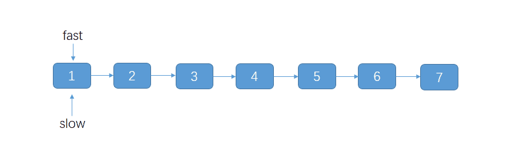

# Linkedlist Overview

单链表的一些题目, 对指针的使用非常多. 虽然有些算法题可以借助一些语言提供的工具类来做, 但是会额外的使用多余的内存空间, 如果某些算法题要求你必须使用 O(1) 的空间复杂度, 这种情况下就必须使用指针来做了.

## 多指针

### 双指针

两个指针如果在两个链表上跑, 如果步长相同, 可以:

**比较两链表长度**. 不需要同步跑;

**找到两链表的交点**. 需要同步跑, 跑相同的距离, 最后可以停到交点上. 具体见 👉 [找出两个单链表的交点](找出两个单链表的交点.md)


### 多指针

一般链表问题都需要两个或多指针来标记或找到需要或特定的位置, 比如最经典的**反转链表**问题. 解决这个问题的思路就是使用前中后三个指针. 

当然, 多指针或双指针并不是一定要一个指向前一个指向后, 而是一种思想, 我们可以利用指针标记位置或作为临时节点, 来实现链表中节点指向的变换.

反转链表问题这道题也可以通过**递归和栈**的思路来做, 本文给出 5 种解决方法, 具体代码参考 👉 [反转链表](反转链表.md)


## 快慢指针找到单链表中某个指定节点

快慢指针是单链表题目中经常会用到的方法, 即两个指向 head 的指针, fast 快, slow 慢. 一般有两种快慢度量:

### 步长不同决定指针快慢

比如 fast 指针每次走两步 (或 n 步), 即 `fast = fast.next.next`, slow 每次走 1 步, 即 `slow = slow.next`. 这样, 可以实现两种功能:


**找到非环链表的中间节点 (或特定分位节点);**

我们让快指针每次走两步, 让慢指针每次走一步, 这样当快指针走到链表的末尾, 慢指针就指向了链表的中间节点:

```java
public static ListNode findMidNode(ListNode head) {
    ListNode fastNode = head;
    ListNode slowNode = head;
    ListNode prev = null;
    while (fastNode != null && fastNode.next != null) {
        prev = slowNode;
        fastNode = fastNode.next.next;
        slowNode = slowNode.next;
    }
    return slowNode;
}
```

对于奇数节点的, slow 节点会定位到中间位置; 对于欧树节点的, 会定位到后一半的开始节点. 但都是 `n / 2 + 1`.


**判断链表是否存在环.** 在 fast 指向非空前, 通过判断是否有 `fast == slow` 的时刻来判断单链表是否存在环. 这就好比一快一慢两个人在操场跑步, 跑得快的注定会与慢的相遇.

👉 [判断单链表是否有环](判断单链表是否有环.md)


### 步长相同但提前出发

**一般用来找到倒数第 k 个节点.** 

也就是说, 我们令 fast 节点先走 k 步, 然后 slow 开始从头和 fast 一起走, 当 fast 走到最后时, slow 就走到倒数第 k 个节点:

 

其代码模板如下:

```java
public ListNode method(ListNode head, int k) {
    // 快指针, 我们先让它走 k 步
    ListNode fast = head;
    for (int i = 0; i < k; i++) {
        fast = fast.next;
    }
    // 然后将快的指针和慢的指针一起走, 当快指针走到链表末尾, 慢指针指向的就是倒数第 K 个节点
    ListNode temp = head;
    // 你要找的倒数第 k 个节点的前一个节点. 因为如果你要操作第 k 个节点, 一般需要找到第 K 个节点的前前驱节点
    // 像上面第 2 道的算法题, 删除链表的第 K 个节点就需要用到 preNode
    ListNode preNode = null;
    while (fast != null ) {
        preNode = temp;
        temp = temp.next;
        fast = fast.next;
    }
    return temp;
}
```

Leetcode 上的题目 [返回一个链表的倒数第 k 个节点](https://leetcode-cn.com/problems/kth-node-from-end-of-list-lcci/) 和 [删除链表的倒数第N个节点](https://leetcode-cn.com/problems/remove-nth-node-from-end-of-list/) 就可以直接通过这个模板解决. 而 👉 [旋转链表](旋转链表.md) 思路其实也是找到链表中倒数第 `k % length` 个节点.

而这道中等难度的题目[143. 重排链表](https://leetcode-cn.com/problems/reorder-list/)刚好可以拿上面说过的两个方法 (找到中间节点和反转链表) 来解决, 具体解决方法见 👉 [重排链表](重排链表.md)


# References

1. [链表算法题型的总结](https://juejin.im/post/6854573219190407175#comment)
2. [cyc2018.github.io/CS-Notes/链表](https://cyc2018.github.io/CS-Notes/#/notes/Leetcode%20%E9%A2%98%E8%A7%A3%20-%20%E9%93%BE%E8%A1%A8)

