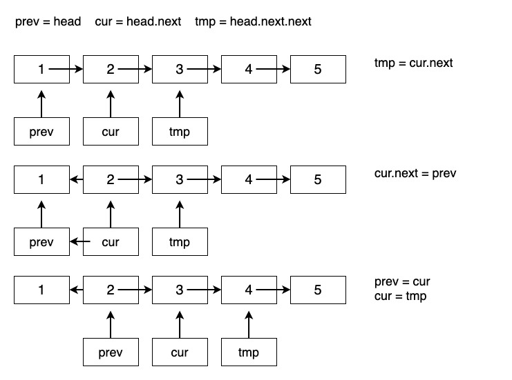

# 反转链表

[206. 反转链表](https://leetcode-cn.com/problems/reverse-linked-list/)

经典题目, 一般有三种实现方法: 栈法, 递归法, 三指针法

## 栈法

这种方法的思路是最简单的, 因为栈本身就是实现线性结构倒序的常用工具. 因为是**牺牲空间换取时间的做法**, 执行时间应该会比较短, 但有较大空间消耗. 

1. 将链表节点一次存入栈中;
2. 创建新头节点 newHead;
3. 依次将栈中元素取出并链接到 newHead.next.

代码实现:

```java
public ListNode reverseList(ListNode head) {
    Stack<ListNode> stack = new Stack<ListNode>();
    ListNode newHead=null,current;
    while (head!=null){
        stack.push(head);
        head=head.next;
    }
    if (!stack.isEmpty()){
        newHead = stack.pop();
        current = newHead;
        while (!stack.isEmpty()){
            current.next = stack.pop();
            current = current.next;
        }
        current.next=null;
    }
    return newHead;
}
```


## 三指针(迭代反转)

假设存在链表 1 → 2 → 3 → Ø，我们想要把它改成 Ø ← 1 ← 2 ← 3。

在遍历列表时, 将当前节点的 next 指针改为指向前一个元素. 由于节点没有引用其上一个节点, 因此必须事先存储其前一个元素. 在更改引用之前, 还需要另一个指针来存储下一个节点.

所以需要三个指针! 最后不要忘记在最后返回新的头引用.

该算法的实现思想非常直接, 就是从当前链表的首元节点开始, 一直遍历至链表的最后一个节点, 这期间会逐个改变所遍历到的节点的指针域, 另其指向前一个节点.

图解如下:



```java

public ListNode reverseList(ListNode head) {
    ListNode prev = null;
    ListNode curr = head;
    while (curr != null) {
        ListNode nextTemp = curr.next;
        curr.next = prev;
        prev = curr;
        curr = nextTemp;
    }
    return prev;
}
```

复杂度分析

时间复杂度: O(n), 假设 n 是列表的长度, 时间复杂度是 O(n).
空间复杂度: O(1)

利用栈会占用较大的空间.


## 递归法

和迭代反转法的思想恰好相反, 递归反转法的实现思想是从链表的尾节点开始, 依次向前遍历, 遍历过程依次改变各节点的指向, 即另其指向前一个节点.

递归版本稍微复杂一些, 其关键在于反向工作: 假设列表的其余部分已经被反转, 现在我该如何反转它前面的部分?

假设 cur 之后的都已经反转了, 那么怎么改变 cur 和 cur.next 的关系呢? 可以通过以下两行代码:

```java
cur.next.next = cur;
cur.next = null; // 释放指向下一个节点
```

所以总的代码可以是:

```java
public ListNode reverseList(ListNode head) {
    if (head == null || head.next == null) return head;
    ListNode p = reverseList(head.next);
    // 这两行是反转的关键
    head.next.next = head; // 第一次分析 head 是倒数第二, 因为 head.next 为 null
    head.next = null; 
    return p; // p 只是为了传递尾节点, 关键步骤在上两行
}
```


## 头插法

所谓头插法, 是指在原有链表的基础上, 依次将位于链表头部的节点摘下, 然后采用从头部插入的方式生成一个新链表, 则此链表即为原链表的反转版.

头插法的关键在于创建了一个新链表, 并逐步把原来链表的头结点插到新链表的头结点 (当然原链表的尾节点最后会作为新链表的头结点):

```java
public ListNode reverseList(ListNode head) {
    ListNode new_head = null; // new_head 为新链表的头, 从原链表取下来的每个 head 的 head.next = new_head 即可实现反转, 但紧接着 new_head 要更新
    ListNode temp = null;
    while(head != null){
        temp = head.next; // 用于找到原 head 的下一个, 在去掉原 head 后, 使 head 指向 temp, 即原来链表中的 head 的下一个
        head.next = new_head;
        new_head = head;
        head = temp;
    }
   	return new_head;
}
```


## 就地逆置反转链表

就地逆置法和头插法的实现思想类似, 唯一的区别在于, 头插法是通过建立一个新链表实现的, 而就地逆置法则是直接对原链表做修改, 从而实现将原链表反转.

值得一提的是, 在原链表的基础上做修改, 需要额外借助 2 个指针 (假设分别为 beg 和 end):

```java
public ListNode reverseList(ListNode head) {
    ListNode prev = head;
    ListNode cur = head.next;
    while(cur != null){
        prev.next = cur.next; // 将 end 从链表中摘除, 即跳过了 cur, 这个时候 cur.next 还是指向原表下一个的, 但我们会在下一步将其指向 head
        cur.next = head; // 将 end 移动至链表头
        head = cur;
        cur = prev.next;
    }
    return head;
}
```


# References

1. [Leetcode-解答-反转链表](https://leetcode-cn.com/problems/reverse-linked-list/solution/fan-zhuan-lian-biao-by-leetcode/)
2. [Leetcode-解答-java栈反转链表](https://leetcode-cn.com/problems/reverse-linked-list/solution/javazhan-fan-zhuan-lian-biao-by-junking-3/)

