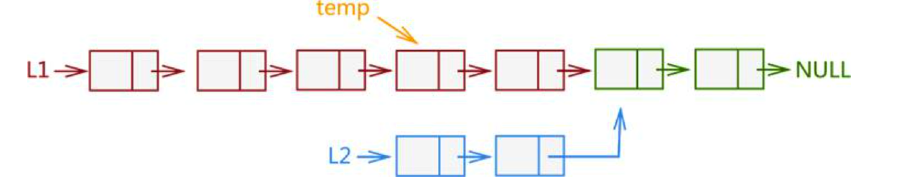

# 找出两个链表的交点

[160. Intersection of Two Linked Lists (Easy)](https://leetcode-cn.com/problems/intersection-of-two-linked-lists/description/)

要求时间复杂度为 O(N), 空间复杂度为 O(1), 如果不存在交点则返回 `null`.

例如以下示例中 A 和 B 两个链表相交于 c1:

```
A:          a1 → a2
                    ↘
                      c1 → c2 → c3
                    ↗
B:    b1 → b2 → b3
```


但是不会出现以下相交的情况, 因为每个节点只有一个 next 指针, 也就只能有一个后继节点, 而以下示例中节点 c 有两个后继节点:

```
A:          a1 → a2       d1 → d2
                    ↘  ↗
                      c
                    ↗  ↘
B:    b1 → b2 → b3        e1 → e2
```

**思路①** 肯定需要两个指针, 找到相交节点的一个思路就是相遇. 相遇的直接思路是相同路程, 但直接遍历由于 a 段和 b 段路程不同不会相遇, 所以可以这样考虑: 设 A 的长度为 a + c, B 的长度为 b + c, 其中 c 为尾部公共部分长度, 可知 a + c + b = b + c + a, 这样就有相同路程了.

**实现**: 当访问 A 链表的指针访问到链表尾部时, 令它从链表 B 的头部开始访问链表 B; 同样地, 当访问 B 链表的指针访问到链表尾部时, 令它从链表 A 的头部开始访问链表 A. 这样就能控制访问 A 和 B 两个链表的指针能同时访问到交点.

如果不存在交点, 那么 a + b = b + a, 以下实现代码中 l1 和 l2 会同时为 null, 从而退出循环. 代码如下:

```java
public ListNode getIntersectionNode(ListNode headA, ListNode headB) {
    if(headA == null || headB == null) return null;
    ListNode l1 = headA, l2 = headB;
    while(l1 != l2){
        l1 = (l1 == null) ? headB : l1.next;
        l2 = (l2 == null) ? headA : l2.next;
    }
    return l1;
}
```

**思路②** 

如下图, 从较长链表 L1 尾部选取和 L2 链表等长度的一个子链表, 同时遍历 temp 和 L2 链表, 依次判断 2 个遍历的节点是否相同, 如果相同则表明 L1 和 L2 相交; 反之则不相交. 这种方法其实和最开始的方法思想相同, 但是好处是可以找到相交的节点. 



但是实际上, 这种方式其实跟第一种思路是相同的, 反而第一种实现起来更为简单, 所以这里不再给出具体的代码实现.

